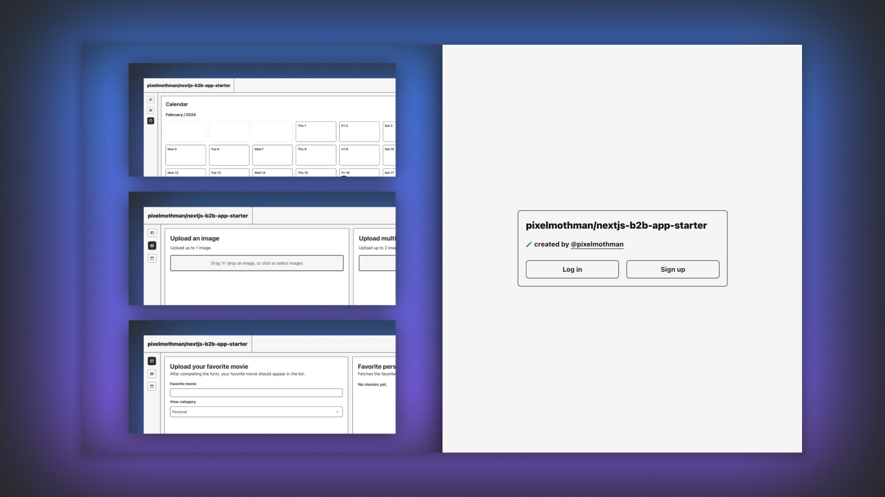

# ⚡️ pixelmothman/nextjs-b2b-app-starter

This template provides a starting point for building B2B web applications using Next.js, Supabase for database and storage, PropelAuth for authentication, Zod for schema validation, TailwindCSS for styling, Radix-ui for some UI components, React Hot Toast for smoking hot React notifications, and React Dropzone for a simple React hook to create a HTML5-compliant drag'n'drop zone for files.

## Powered by

- ◽️ **Next.js**: a React framework for building full-stack web applications.
- 💾 **Supabase**: an open source platform that allows users to build production-grade applications with a Postgres database, Authentication, instant APIs, Realtime, Functions, Storage, and Vector embeddings.
- 🟢 **PropelAuth**: provides end-to-end managed user authentication specializing in B2B use cases.
- ✨ **Zod**: TypeScript-first schema validation with static type inference.
- 🧪 **TailwindCSS**: a utility-first CSS framework packed with classes that can be composed to build any design, directly in the markup.
- 🏗️ **Radix-ui Primitives**: An open-source UI component library for building high-quality, accessible design systems and web apps.
- 🔥 **React Hot Toast**: smoking hot React notifications.
- 🚁 **React Dropzone**: simple React hook to create a HTML5-compliant drag'n'drop zone for files.

## Getting Started

### 1. Environment Setup

Clone the repository and create a `.env.local` file in the root directory. Add the following environment variables with your specific values:

```plaintext
NEXT_PUBLIC_AUTH_URL=''
PROPELAUTH_API_KEY=''
PROPELAUTH_VERIFIER_KEY=''
PROPELAUTH_REDIRECT_URI='http://localhost:3000/api/auth/callback'
SUPABASE_URL=''
SUPABASE_SERVICE_KEY=''
SVIX_WEBHOOK_NEW_ORG=''
SVIX_WEBHOOK_DEL_ORG=''
SVIX_WEBHOOK_MOD_ORG=''
SVIX_WEBHOOK_NEW_USER=''
SVIX_WEBHOOK_DEL_USER=''
SVIX_WEBHOOK_MOD_USER=''
```

### 2. PropelAuth Configuration

Go to the PropelAuth dashboard and configure the following in the frontend integration section:

- Default redirect path after login: `/api/auth/callback`
- Default redirect path after logout: `/api/auth/logout`
When your project goes live, update the Application URL in the PropelAuth dashboard with your application's URL.

### 3. Supabase Setup

#### 3.1. Database Initialization

Create a new database in Supabase and set up the following tables:

- Organizations
- Users
- Favorite Movies
- Organizations to be Deleted (for cron jobs)
- Calendar Events

Tables definitions:
- Organizations

```sql
    create table
    org_table (
        org_id uuid not null,
        org_name text not null default 'Example Org'::text,
        org_users smallint not null default '1'::smallint,
        created_at timestamp with time zone not null default now(),
        constraint org_table_pkey primary key (org_id),
        constraint org_table_org_id_key unique (org_id)
    ) tablespace pg_default;
```
- Users

```sql
    create table
    user_table (
        user_id uuid not null,
        org_id uuid not null,
        user_name text not null,
        user_email text not null,
        user_role text not null,
        created_at timestamp with time zone not null default now(),
        constraint user_table_pkey primary key (user_id),
        constraint user_table_org_id_fkey foreign key (org_id) references org_table (org_id) on update cascade on delete cascade
    ) tablespace pg_default;
```

- Favorite Movies

```sql
    create table
    fav_movies_table (
        org_id uuid not null,
        user_id uuid not null,
        movie_name text not null,
        created_at timestamp with time zone not null default now(),
        movie_id uuid not null default gen_random_uuid (),
        movie_view_category text not null,
        constraint fav_movies_table_pkey primary key (movie_id),
        constraint fav_movies_table_org_id_fkey foreign key (org_id) references org_table (org_id) on update cascade on delete cascade,
        constraint fav_movies_table_user_id_fkey foreign key (user_id) references user_table (user_id) on update cascade on delete cascade
    ) tablespace pg_default;
```

- Organizations to be deleted (for cron jobs)

```sql
    create table
    org_to_delete_table (
        org_id uuid not null,
        user_id uuid null,
        created_at timestamp with time zone not null default now(),
        constraint org_to_delete_table_pkey primary key (org_id),
        constraint org_to_delete_table_org_id_fkey foreign key (org_id) references org_table (org_id) on delete cascade,
        constraint org_to_delete_table_user_id_fkey foreign key (user_id) references user_table (user_id)
    ) tablespace pg_default;
```

- Calendar events

```sql
    create table
    calendar_events_table (
        cal_event_id uuid not null default gen_random_uuid (),
        cal_event_name text not null,
        cal_event_description text not null,
        cal_event_start_date timestamp with time zone not null,
        cal_event_end_date timestamp with time zone not null,
        created_at timestamp with time zone not null default now(),
        org_id uuid not null,
        user_id uuid not null,
        cal_event_label text not null,
        constraint calendar_table_pkey primary key (cal_event_id),
        constraint calendar_events_table_org_id_fkey foreign key (org_id) references org_table (org_id) on update cascade on delete cascade,
        constraint calendar_events_table_user_id_fkey foreign key (user_id) references user_table (user_id) on update cascade
    ) tablespace pg_default;
```

#### 3.2. Storage Bucket

Create a new bucket in Supabase storage for images:

- Bucket Name: `images`

### 4. Adding Users and Organizations

While in development mode, you can manually add users and organizations directly in Supabase.

### 5. SVIX Integration

Configure webhooks in PropelAuth to integrate with SVIX for events related to organizations and users (creation, update, deletion). You'll need an "Endpoint URL" which is the URL from Vercel followed by the corresponding route.

## Disclaimer

The instructions and guidelines provided in this document reflect the author's opinions and are offered for informational purposes only. Users should exercise their judgment in applying any practices described here. While this project is licensed under the MIT License, which includes its own disclaimers, please note that the author assumes no responsibility for outcomes resulting from the use of this software or its documentation.
